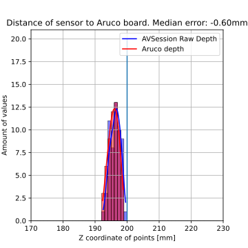
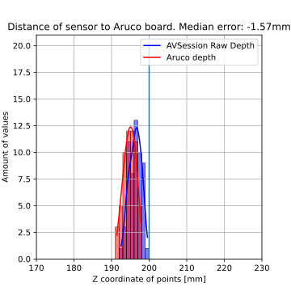
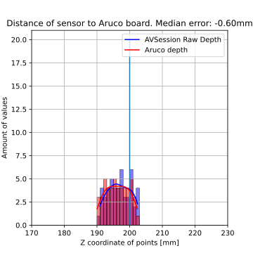
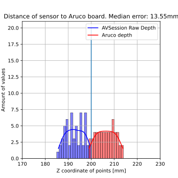
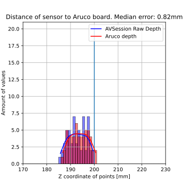

# Issues with iPad TrueDepth data
This repository contains:

1. Python code to reproduce the results from the accompanying paper 
2. A barbones iOS app to record depth and RGB data with either the AVFoundation or the ARKit API

The issues are described in detail in the following [paper](https://arxiv.org/abs/2201.10865):

    @article{urban2022issues,
        title={On the Issues of TrueDepth Sensor Data for Computer Vision Tasks Across Different iPad Generations},
        author={Urban, Steffen and Lindemeier, Thomas and Dobbelstein, David and Haenel, Matthias},
        journal={arXiv preprint arXiv:2201.10865},
        year={2022}
    }

## Installation
To install the Python dependencies run:
```python
pip install -r requirements.txt
```

To install the iOS data recording app visit: [iPad_TrueDepth_Issue_App](https://github.com/ZEISS/iPad_TrueDepth_Issue_App)

## Usage
We provide three sample datasets.

| Device            | Has misaligned depth in ARKit API | Has wrong focal length in both APIs |
|-------------------|-----------------------------------|-------------------------------------|
| iPhone11Pro       | :heavy_multiplication_x:  | :heavy_multiplication_x: |
| iPadPro 12.9 4gen | :heavy_check_mark:  | :heavy_multiplication_x:  |
| iPadPro 12.9 5gen | :heavy_multiplication_x: |  :heavy_check_mark: |

 1. iPhone 11 Pro: Here everything is fine. The factory intrinsics and our calibrated values match quite well.
 2. iPadPro 12.9 4gen: With this iPad the factory calibration will also be quite good. In this case however, the depth and color images do not align if recorded with ARKit API. (same problem: iPadPro 11 2gen)
 3. iPadPro 12.9 2gen: Here the factory intrinsics do not match the calibrated intrinsics. If the factory intrinsics are used to unproject the depth values you can see that they are wrong. (same problem: iPadPro 11 3gen)

## Camera calibration - Verifying factory intrinsics
In a first step, we can calibrate the intrinsics of the TrueDepth RGB camera and verify the factory intrinsics proveded by the API. 
Make sure, that you extracted the dataset into this repository folder. Otherwise you'll need to adapt the paths.
The provided datasets were **recorded with the AVFoundation API**!
To calibrate the cameras run:
```python
python calibrate_front_camera.py
```

The results for the provided datasets should be:

| Device            | Factory focal length [px] | Calibrated focal length [px] | Difference in [%] |
|-------------------|--------------|------------|---------------|
| iPhone11Pro       | 436.5  | 434.61 | -0.43 % |
| iPadPro 12.9 4gen | 595.34  | 602.38 | 1.18 % |
| iPadPro 12.9 5gen | 565.12 | 530.04 | **-6.21 %** |

**The iPadPro 12.9 5gen has large deviations. About same difference will appear for iPadPro 11 3gen. Both of these have a wide angle lens and factory intrinsics are not correct in both AVFoundation and ARKit APIs.**

For both iPhone and iPadPro 12.9 4gen the intrinsics seem to match quite well. **The intrinsics as well as depth and meta data returned by AVFoundation for iPhones, iPadPro 12.9 4gen and iPadPro 11 2gen are correct.**

### Calibrate your own device
First you will need to record some calibration images:

1. Print the [board](resource/calib_board.png) or display it on a screen. If printed the board should be attached to a table or a wall as flat and rigid as possible.
2. Record some data with our barebones app
3. Copy all images to the FrontCamCalibrationDataset folder
4. Measure the square size in [cm]
5. Create a file in your image folder called checkersize.txt and fill it with just your checker square size in [cm], e.g. 2.15 
6. Run the calibrate_front_camera.py script.

## Depth verification
To verify that the provided TrueDepth data is valid, we can either use the factory or our calibrated intrinsincs to unproject the Charuco corners with the depth image to a point cloud. Those points can then be compared to the known Charuco 3D points transformed to the camera coordinate system. 
This is implemented in [evaluate_depth.py](evaluate_depth.py).
First make sure that you run the camera calibration script first!

Then you can run the depth evaluation either with our calibrated intrinsics.
This will create output folders in DepthEvalDataset/* /result_*
```python
python evaluate_depth.py --use_own_calibration --plot_debug
```
or factory values:
```python
python evaluate_depth.py --plot_debug
```

The results will look like this. The blue line at 200mm is just an indication and not a ground truth distance. The iPads were held at approximately 200mm fronto parallel to the Charuco board. (check out the images)
| Device            | Factory | Calibrated |
|-------------------|--------------|------------|
| iPhone11Pro       |   |  |
| iPadPro 12.9 4gen |   |  |
| iPadPro 12.9 5gen |   |  |


# Contributing
To contribute you must sign the **ZEISS CLA** depending if your are acting as an [individual](zeiss_indv_cla.txt) or represent a [company](zeiss_corp_cla.txt).
